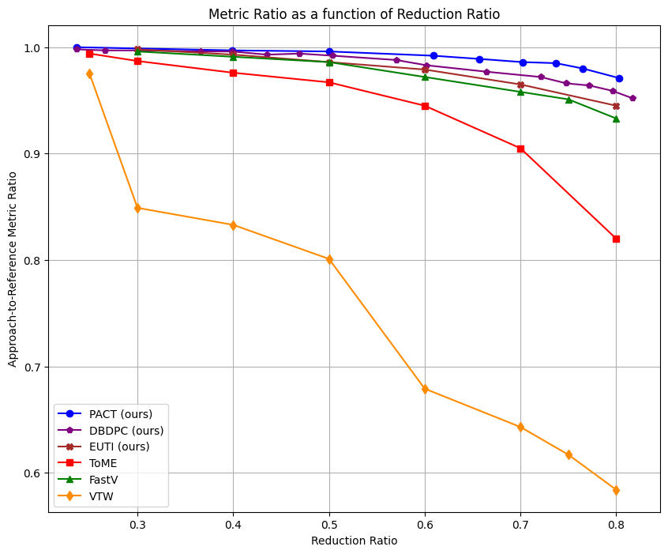
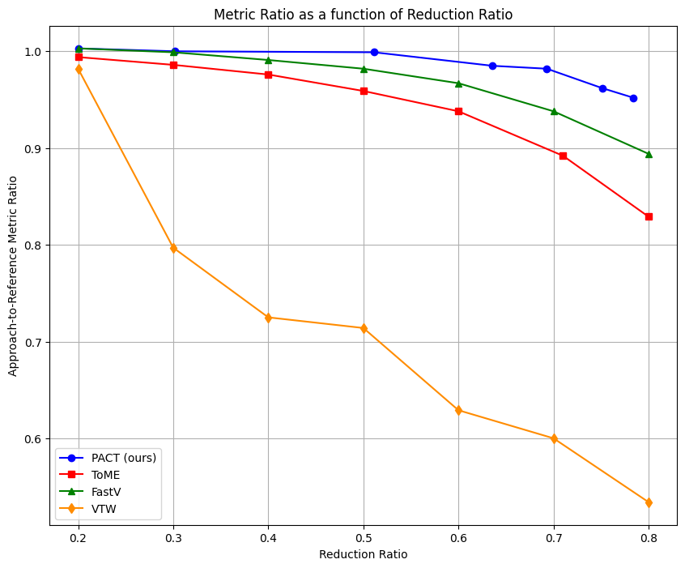
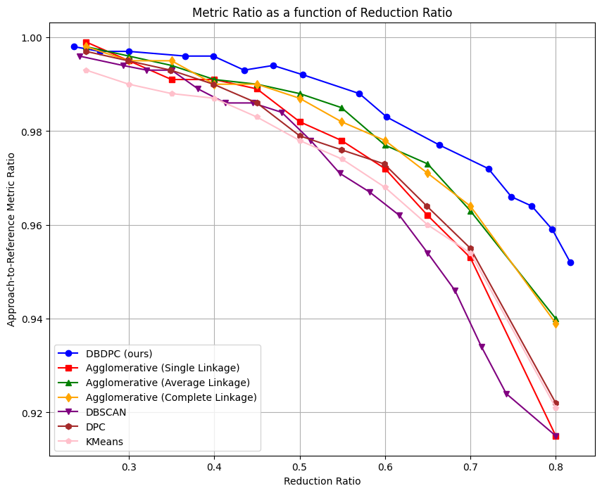
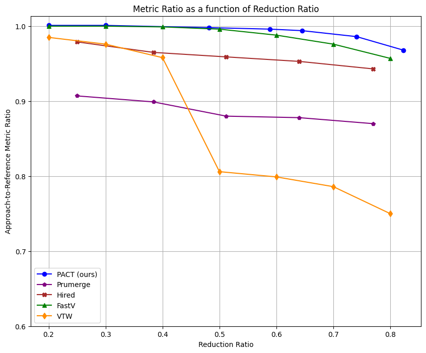

# PACT: Pruning and Clustering-Based Token Reduction for Faster Visual Language Models, CVPR 2025

[](https://arxiv.org/abs/2504.08966)

## PACT Performance


<table>
  <tr>
    <td></td>
    <td></td>
  </tr>
  <tr>
    <td align="center"><span style="font-size:10px">PACT vs other methods on LLaVA-OneVision-7B</span></td>
    <td align="center"><span style="font-size:10px">PACT vs other methods on Qwen2-VL-7B</span></td>
  </tr>
  <tr>
    <td></td>
    <td></td>
  </tr>
  <tr>
    <td align="center"><span style="font-size:10px">DBDPC vs other clustering algorithms on LLaVA-OneVision-7B</span></td>
    <td align="center"><span style="font-size:10px">PACT vs other methods on LLaVA-1.6-Mistral-7B</span></td>
  </tr>
</table>

## Setup

```bash
conda env create -f environment.yml
conda activate pactenv
pip install flash-attn==2.6.3
```

## Usage

### 1. Testing Existing Methods

Our repo allows you to test **PACT** along with different visual token reduction methods like **FastV**, **Visual Token Withdrawal**, **ToMe**, and four clustering algorithms :agglomerative clustering, k-means, Density Peaks Clustering, and DBSCAN.

You can find scripts in the `scripts` folder to reproduce results from the paper. 
For example, to test PACT on LLaVA-OneVision-7B, you can run:

```bash
cd PACT/scripts
bash pact_llava-onevision7b.sh
```
[This script file](scripts/test_different_methods_llava-onevision7b.sh) demonstrates how to test all the different methods supported by our repository. Each method is defined by a config file, with different config files available in the [the configs folder](configs/).
For documentation on config file parameters, refer to this [file](docs/CONFIGDOC.md).

### 2. Testing New Methods (Custom)

You can also test a custom pruning or clustering-based reduction method or combine both by using:
- [custom_clustering.json](configs/custom_clustering.json) for custom clustering based methods.
- [custom_pruning.json](configs/custom_pruning.json) for custom pruning methods
- [custom_combined.json](configs/custom_combined.json) for combinig both pruning and clustering-based merging.

In addition to using the correct config file, you need to implement your reduction logic by modifying the `custom_pruning` function (which computes scores for token pruning) or/and the `custom_token_reduction` function (which typically defines a clustering-then-merging method) in [utils.py](transformers/PACT/utils.py). Please refer to the documentation of these functions for more details. Once implemented, you can easily test your custom pruning methods, your custom clustering-based reduction methods, or even combine both by running:

```bash
cd PACT/scripts
bash test_custom.sh
```

## Implementation Details

The visual token reduction is implemented by modifying [`llava_arch.py`](LLaVA-NeXT/llava/model/llava_arch.py) and [`modeling_qwen2.py`](transformers/models/qwen2/modeling_qwen2.py) for LLaVA-OneVision, and [`modeling_qwen2_vl.py`](transformers/models/qwen2_vl/modeling_qwen2_vl.py) for Qwen-VL 2.0. The modifications are based on functions defined in [`utils.py`](transformers/PACT/utils.py).


## Citation

If you find our work useful, please consider citing our paper:

@misc{dhouib2025pactpruningclusteringbasedtoken,
      title={PACT: Pruning and Clustering-Based Token Reduction for Faster Visual Language Models}, 
      author={Mohamed Dhouib and Davide Buscaldi and Sonia Vanier and Aymen Shabou},
      year={2025},
      eprint={2504.08966},
      archivePrefix={arXiv},
      primaryClass={cs.CV},
      url={https://arxiv.org/abs/2504.08966}, 
}


## Acknowledgments

This work received financial support from Crédit Agricole S.A. through the research chair with Ecole Polytechnique on Trustworthy and Responsible AI. 
